<div align="center">


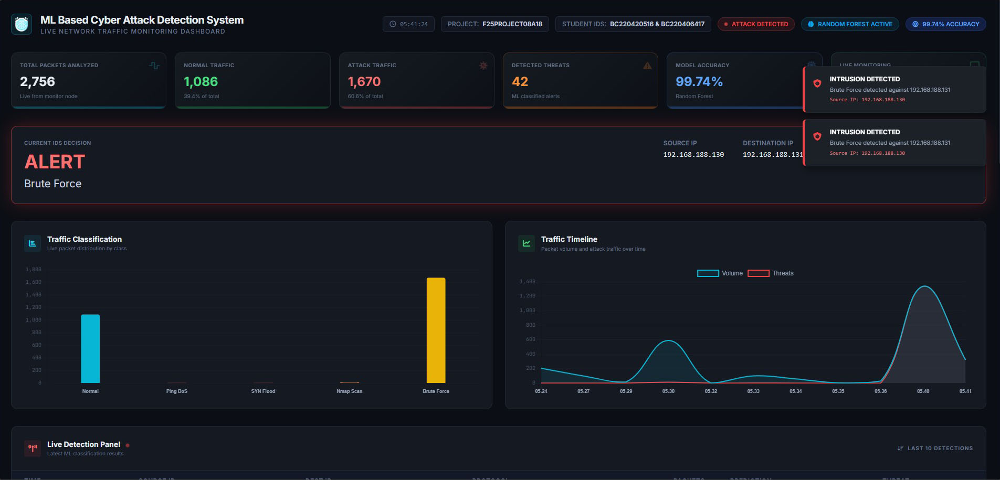

# ML Based Cyber Attack Detection in Simulated Networks

### A complete, end-to-end Machine Learning Intrusion Detection System — from raw packets captured in a virtual GNS3 lab, to a benchmarked Random Forest classifier, to a live real-time monitoring dashboard that flags attacks within one second.

*Every packet in this project was generated, captured, and labelled by hand inside a purpose-built network laboratory. No public datasets. No pre-trained models. Nothing borrowed — the entire pipeline was built from the ground up.*


<sub><b>Project code:</b> F25PROJECT08A18 &nbsp;•&nbsp; <b>Department of Software Engineering, Virtual University of Pakistan</b></sub>

</div>

---

## 📖 Table of Contents

- [What This Project Is](#-what-this-project-is)
- [Why It Matters](#-why-it-matters)
- [The Five Traffic Classes](#-the-five-traffic-classes)
- [Key Features](#-key-features)
- [System Architecture](#-system-architecture)
- [Lab Topology](#-lab-topology)
- [Repository Structure](#-repository-structure)
- [Phase 1 — Building the Virtual Lab](#-phase-1--building-the-virtual-lab)
- [Phase 2 — Generating & Capturing Traffic](#-phase-2--generating--capturing-traffic)
- [Phase 3 — Feature Engineering](#-phase-3--feature-engineering)
- [Phase 4 — Training & Benchmarking](#-phase-4--training--benchmarking)
- [Phase 5 — Real-Time Detection Engine](#-phase-5--real-time-detection-engine)
- [The Live Dashboard](#-the-live-dashboard)
- [Forensic Logging](#-forensic-logging)
- [Installation & Usage](#-installation--usage)
- [Complete Feature Reference](#-complete-feature-reference)
- [Results Summary](#-results-summary)
- [Design Decisions & Engineering Notes](#-design-decisions--engineering-notes)
- [Limitations & Future Work](#-limitations--future-work)
- [Security & Ethics Notice](#-security--ethics-notice)
- [Authors](#-authors)
- [License](#-license)

---

## 🎯 What This Project Is

**ML Based Cyber Attack Detection in Simulated Networks** is a full-lifecycle Intrusion Detection System (IDS) that demonstrates — concretely, with evidence at every step — how a machine learning model can distinguish normal network behaviour from live cyber attacks in real time.

The project deliberately avoids the shortcut taken by most academic IDS work. Instead of downloading a ready-made dataset like NSL-KDD or CICIDS2017, **every packet was produced inside a controlled virtual network built specifically for this project.** Attacks were launched from a real Kali Linux machine against a real victim server; benign traffic was generated by genuine service interactions. The result is a dataset the authors understand completely, down to the individual capture session that produced every row.

The system spans two operational phases:

1. **Offline Training Phase** — packet captures are converted into a labelled feature matrix, and five ML classifiers are trained and benchmarked to select the strongest.
2. **Live Deployment Phase** — the winning model is loaded onto a dedicated monitoring sensor that sniffs traffic, classifies it flow-by-flow every second, and streams verdicts to a real-time web dashboard.

---

## 💡 Why It Matters

Signature-based intrusion detection (the traditional approach) can only catch attacks it already has a rule for. This project explores the alternative: a **behavioural, statistics-driven model** that learns the *shape* of an attack — its packet rates, flag distributions, and port-spread patterns — rather than matching fixed signatures.

The payoff is measurable. The final Random Forest classifier reaches **99.74% accuracy** across five classes, and the deployed system raises an alert within roughly **one second** of an attack beginning. Just as importantly, the project shows the *entire* chain of reasoning — why each feature was chosen, why a hub was used instead of a switch, why heuristic guards back up the model — making it a genuine teaching artifact, not just a score on a slide.

---

## 🔥 The Five Traffic Classes

The system classifies every one-second flow window into exactly one of five categories:

| Label | Class | Threat Level | Attack Tool | Signature Behaviour |
|:-----:|:------|:------------:|:------------|:--------------------|
| `0` | **Normal** | 🟢 Low | — | Legitimate ping, HTTP, SSH and FTP sessions |
| `1` | **Ping DoS** | 🟠 High | `ping -f` | High-rate ICMP echo flood, near-zero inter-packet gap |
| `2` | **SYN Flood** | 🔴 Critical | `hping3 -S --flood` | Thousands of half-open TCP handshakes, 100% unanswered |
| `3` | **Nmap Scan** | 🟡 Medium | `nmap -sS -p-` | Sequential port sweep, very high unique-destination-port entropy |
| `4` | **Brute Force** | 🟠 High | `hydra ... ssh` | Repeated SSH auth attempts, elevated RST ratio on port 22 |

---

## ✨ Key Features

- 🧪 **100% self-generated dataset** — 8 hand-captured PCAP files across 8 dedicated capture sessions, zero third-party data
- 🔬 **34 engineered flow features** — volume, rate, protocol mix, all six TCP flags, port diversity, plus 3 custom composite discriminators
- 🤖 **5 classifiers benchmarked head-to-head** — Random Forest, Decision Tree, KNN, Logistic Regression, SVM, each with full classification reports and confusion matrices
- ⚡ **Sub-second real-time detection** — 1-second sliding capture window with per-flow classification
- 🧠 **Hybrid ML + heuristic decision logic** — model predictions reinforced by deterministic guards to suppress false positives and catch obvious floods
- 🎯 **True attacker attribution** — multi-stage flow-direction resolution correctly identifies the initiator, not the victim
- 📊 **Live web dashboard** — dark-themed operations console refreshing every 500 ms with charts, a rolling detection table, topology view, alerts and toast notifications
- 📁 **Date-structured forensic logging** — every classification appended to per-session CSV audit logs organised into daily folders
- 🌐 **Fully reproducible** — the GNS3 project file, all PCAPs, the dataset, and all model artifacts are included so the entire experiment can be rebuilt or re-run

---

## 🏗️ System Architecture

```
  ╔═════════════════════════╗        ╔══════════════════════════╗
  ║   PHASE A — TRAINING     ║        ║   PHASE B — DEPLOYMENT   ║
  ║   (offline, Windows)    ║        ║   (live, Ubuntu sensor)  ║
  ╠══════════════════════════╣        ╠══════════════════════════╣
  ║  8 PCAP captures        ║        ║  Scapy live sniffer      ║
  ║         │               ║        ║         │                ║
  ║         ▼               ║        ║         ▼                ║
  ║  pcap_to_csv.py         ║        ║  Flow grouping           ║
  ║  (34-feature windows)   ║        ║         │                ║
  ║         │               ║        ║         ▼                ║
  ║         ▼               ║        ║  Feature extraction      ║
  ║  ids_dataset.csv        ║        ║         │                ║
  ║         │               ║        ║         ▼                ║
  ║         ▼               ║  model ║  best_ids_model.pkl     ║
  ║  train_models.py        ║  ====> ║  .predict()  →  0–4       ║
  ║  (benchmark 5 models)   ║ .pkl   ���         │                ║
  ║         │               ║        ║         ▼                ║
  ║         ▼               ║        ║  Heuristic guards        ║
  ║  best_ids_model.pkl     ║        ║         │                ║
  ║  feature_columns.pkl    ║        ║         ▼                ║
  ║  label_mapping.json     ║        ║  Flask dashboard + CSV   ║
  ╚══════════════════════════╝        ╚══════════════════════════╝
```

The **three exported artifacts** (`best_ids_model.pkl`, `feature_columns.pkl`, `label_mapping.json`) are the only things that cross from the training phase into deployment — a clean, portable handoff.

---

## 🌐 Lab Topology

Four virtual machines are wired through a single **Ethernet hub**, giving the IDS monitor node complete visibility of every frame exchanged between the attacker, the victim, and the legitimate client.

<div align="center">
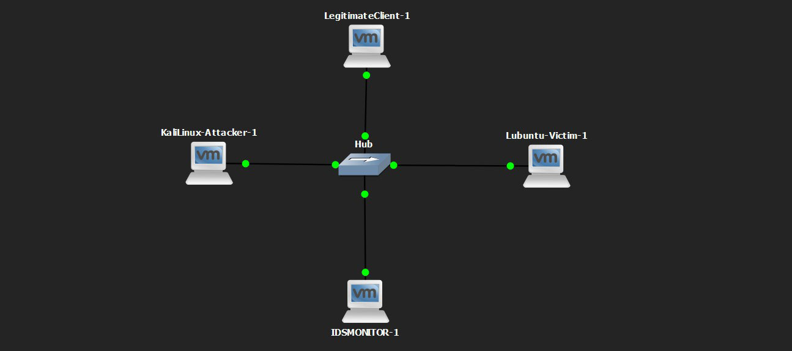
</div>

| Node | Role | IP Address | Operating System | Purpose |
|:-----|:-----|:-----------|:-----------------|:--------|
| **Kali Linux** | Attacker | `192.168.188.131` | Kali Rolling | Launches all four attack types |
| **Lubuntu Server** | Victim | `192.168.188.130` | Lubuntu | Runs Apache2, OpenSSH, vsftpd |
| **Lubuntu Client** | Legitimate user | `192.168.188.133` | Lubuntu | Generates benign background traffic |
| **Ubuntu Monitor** | IDS sensor | `192.168.188.132` | Ubuntu | Runs the Scapy sniffer + Flask dashboard |
| **Ethernet Hub** | Network fabric | — | — | Floods frames to all ports for full visibility |

> 💡 **Why a hub, not a switch?** A switch forwards frames only to their intended destination port, which would blind the monitor to traffic between other hosts. A hub broadcasts every frame to every port, so the IDS sensor sees *all* traffic without requiring managed-switch port mirroring (SPAN). This is the single most important topology decision in the whole lab — without it, passive monitoring is impossible.

---

## 📂 Repository Structure

<div align="center">
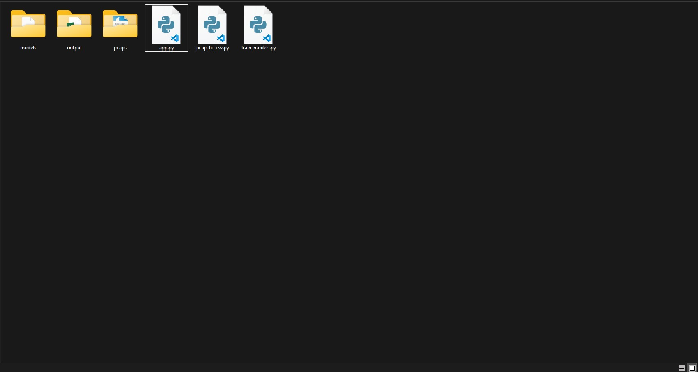
</div>

```
ML-based-Cyber-Attack-Detection-in-Simulated-Networks/
│
├── Windows Training Phase/          # PHASE A — offline training (Windows host)
│   ├── pcaps/                       # 8 hand-captured PCAP files (~96 MB)
│   │   ├── normal_ping.pcap             # label 0 — benign ICMP
│   │   ├── normal_http.pcap             # label 0 — benign HTTP
│   │   ├── normal_ssh.pcap              # label 0 — benign SSH
│   │   ├── normal_ftp.pcap              # label 0 — benign FTP
│   │   ├── attack_ping_dos.pcap         # label 1 — ICMP flood
│   │   ├── attack_syn_flood.pcap        # label 2 — TCP SYN flood
│   │   ├── attack_nmap_scan.pcap        # label 3 — port scan
│   │   └── attack_bruteforce.pcap       # label 4 — SSH brute force
│   ├── output/
│   │   └── ids_dataset.csv              # 1,521 labelled 1-second flow windows × 34 features
│   ├── models/                      # all 5 trained classifiers + artifacts
│   │   ├── random_forest.pkl
│   │   ├── decision_tree.pkl
│   │   ├── knn.pkl
│   │   ├── logistic_regression.pkl
│   │   ├── svm.pkl
│   │   ├── best_ids_model.pkl           # ← the winning Random Forest
│   │   ├── feature_columns.pkl          # exact feature order for inference
│   │   └── label_mapping.json           # {0:"Normal", 1:"Ping DoS", ...}
│   ├── pcap_to_csv.py               # PCAP → windowed feature matrix
│   └── train_models.py              # train, benchmark, persist best model
│
├── Ubuntu Deployment Phase/         # PHASE B — live sensor (Ubuntu monitor)
│   ├── app.py                       # Scapy sniffer + Flask dashboard (single file)
│   ├── models/                      # best_ids_model.pkl, feature_columns.pkl, label_mapping.json
│   ├── static/
│   │   └── security.png                 # dashboard favicon / logo
│   └── logs/                        # auto-generated at runtime
│       └── YYYY-MM-DD/
│           └── HH_MM_SS_traffic_log.csv
│
├── lab/
│   └── gns3/                        # reproducible GNS3 project (F25PROJECT08A18)
│
├── tools/
│   └── ssh_traffic.sh               # benign SSH traffic generator (lab-only creds)
│
└── docs/
    ├── screenshots/                 # 31 evidence screenshots
    └── report/                      # final report + presentation
```

---

## 🔧 Phase 1 — Building the Virtual Lab

Every node was assigned a **static IP address**. This is not cosmetic: the deployment BPF capture filter and the flow-direction logic both reference these fixed addresses, so any DHCP reshuffle would break detection. Locking the addressing down is what makes the lab reproducible.

<table>
<tr>
<td width="50%"><b>🔴 Kali Attacker — <code>192.168.188.131</code></b><br>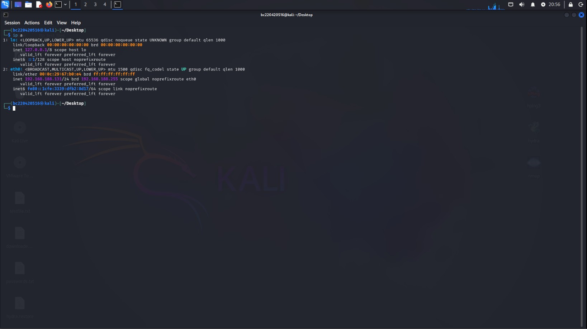</td>
<td width="50%"><b>🟠 Victim Server — <code>192.168.188.130</code></b><br>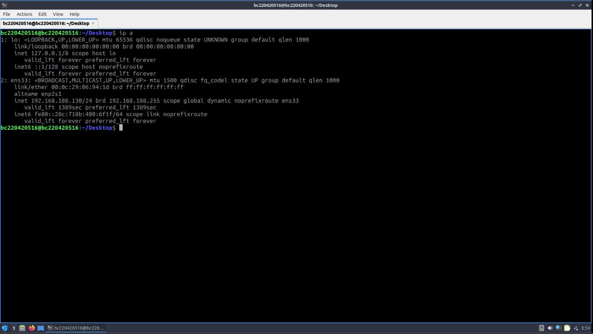</td>
</tr>
<tr>
<td width="50%"><b>🔵 Legitimate Client — <code>192.168.188.133</code></b><br>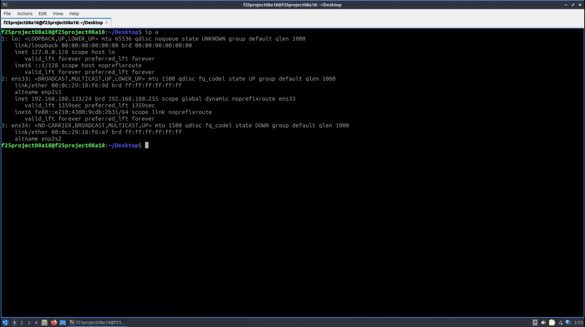</td>
<td width="50%"><b>🟢 IDS Monitor — <code>192.168.188.132</code></b><br>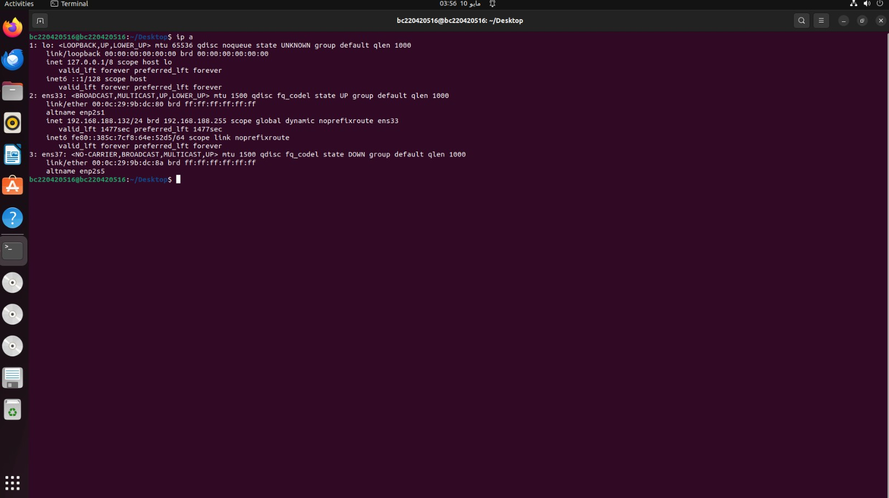</td>
</tr>
</table>

### Victim Services

The victim exposes three real services, giving the attacks authentic targets and giving the model realistic benign traffic to learn from. All three were verified active before captures began.

<table>
<tr>
<td width="33%"><b>Apache2 — HTTP <code>:80</code></b><br>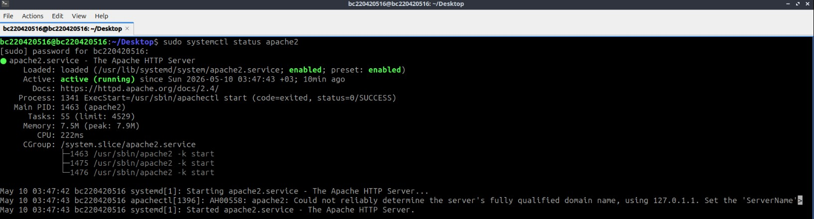</td>
<td width="33%"><b>OpenSSH — <code>:22</code></b><br>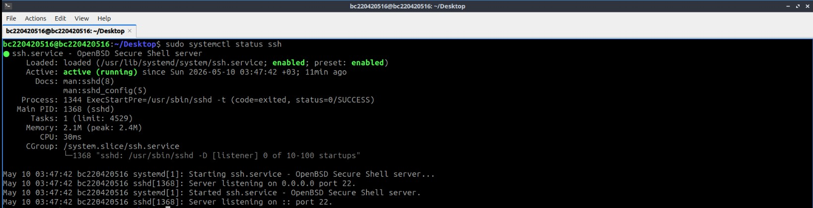</td>
<td width="33%"><b>vsftpd — FTP <code>:20/:21</code></b><br>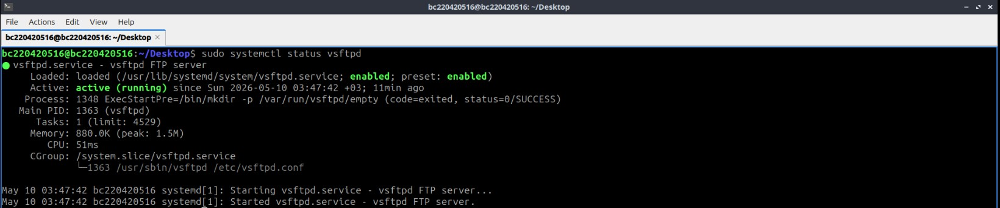</td>
</tr>
</table>

---

## 📡 Phase 2 — Generating & Capturing Traffic

Eight independent capture sessions were run — four benign, four malicious — each saved to its own labelled PCAP. Every command below was executed from the Kali attacker against the victim at `192.168.188.130`, with the IDS monitor passively capturing throughout.

### 🟢 Benign Traffic (label `0`)

<table>
<tr>
<td width="50%"><b>ICMP — normal ping</b><br>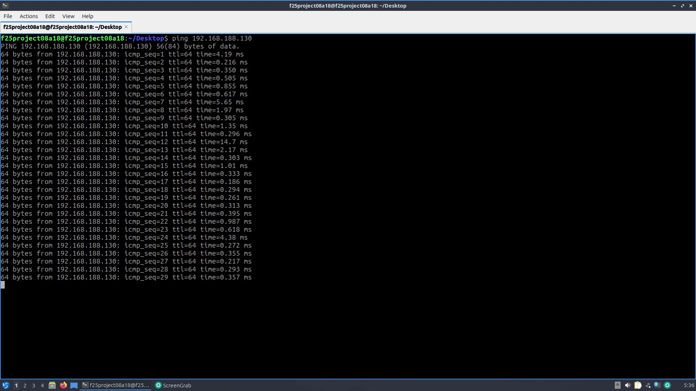</td>
<td width="50%"><b>HTTP — web browsing</b><br>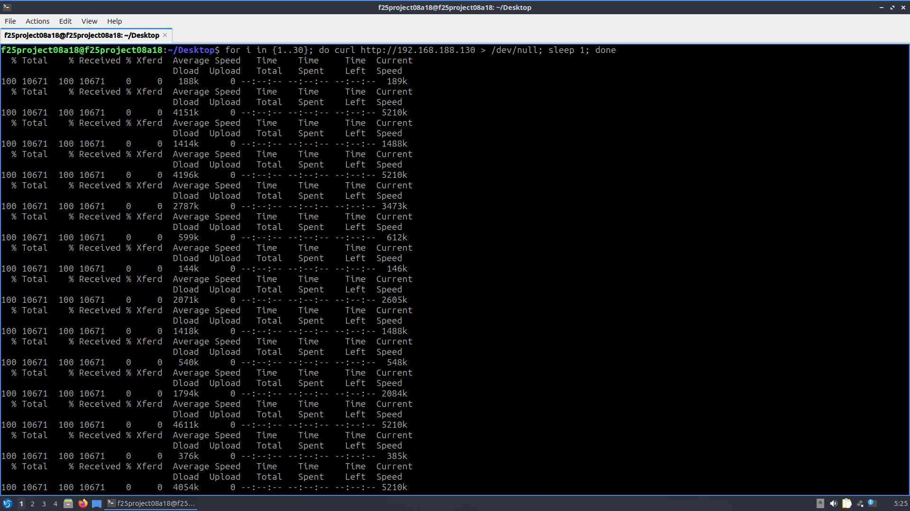</td>
</tr>
<tr>
<td width="50%"><b>SSH — interactive sessions</b><br>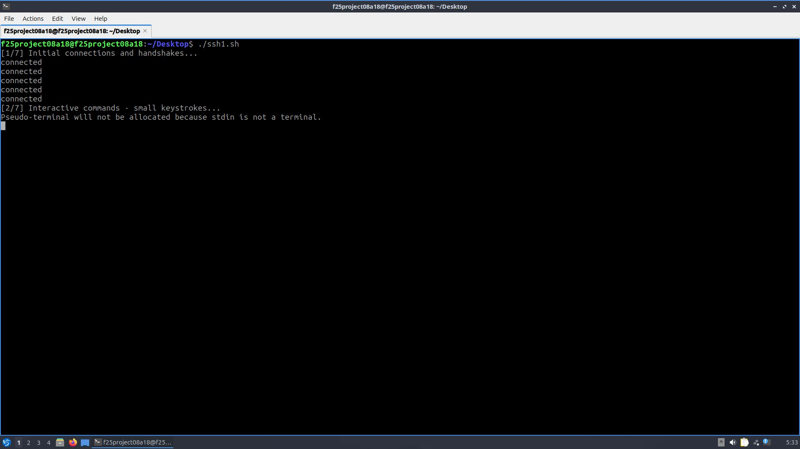</td>
<td width="50%"><b>FTP — file transfer</b><br>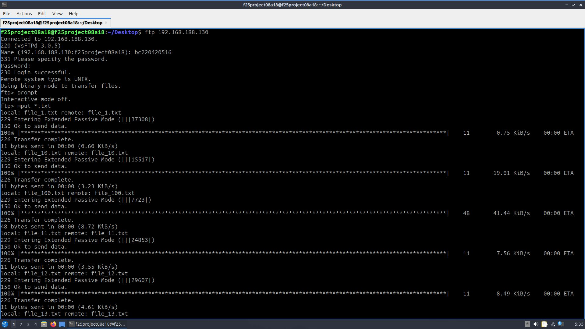</td>
</tr>
</table>

FTP transfers were confirmed on the receiving end to guarantee the sessions genuinely completed rather than merely handshaking:

<div align="center">

</div>

> 🧠 **The hardest problem in the dataset was making benign SSH look benign.** A naive model will flag *all* port-22 traffic as an attack. To prevent this, the benign SSH capture was scripted (`tools/ssh_traffic.sh`) to cover **seven distinct behavioural patterns**: initial handshakes, small interactive keystrokes, idle sessions with keepalives, large command output, SCP file transfers (both directions), mixed command-then-pause activity, and many rapid short sessions. This taught the model what legitimate SSH *actually* looks like, so it learned to key on brute-force-specific signals (RST bursts, ephemeral source-port cycling) rather than the port number alone.

### 🔴 Attack Traffic (labels `1`–`4`)

Each attack was launched with a specific tool and produced measurable, distinctive traffic. The exact commands and their real output:

#### ① Ping DoS — ICMP Flood (label `1`)

```bash
sudo ping -f 192.168.188.130
```
> **Captured result:** `5455 packets transmitted, 5455 received, 0% packet loss, time 5421ms` — the `-f` (flood) flag sends packets as fast as the network allows, producing the near-zero inter-packet gap and high `icmp_count` that defines this class.

<div align="center">
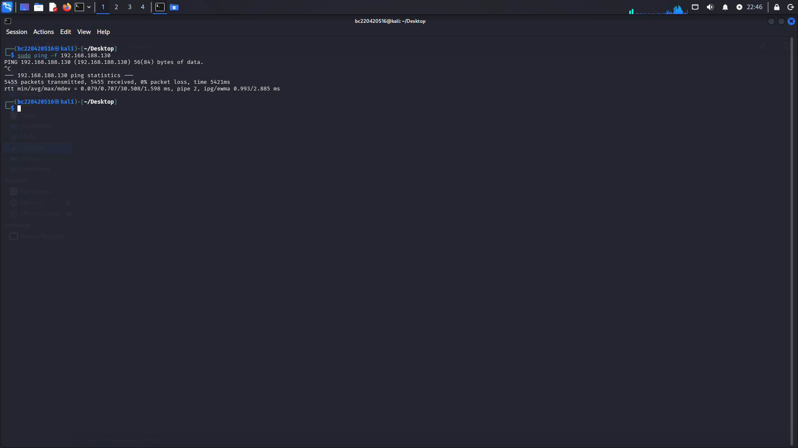
</div>

#### ② SYN Flood — Half-Open TCP (label `2`)

```bash
sudo hping3 -S --flood -p 80 192.168.188.130
```
> **Captured result:** `33648 packets transmitted, 0 packets received, 100% packet loss` — `hping3` fires a relentless stream of TCP `SYN` packets at port 80 and never completes the handshake. The 100% unanswered rate and huge `syn_count` are the signature the model learns.

<div align="center">
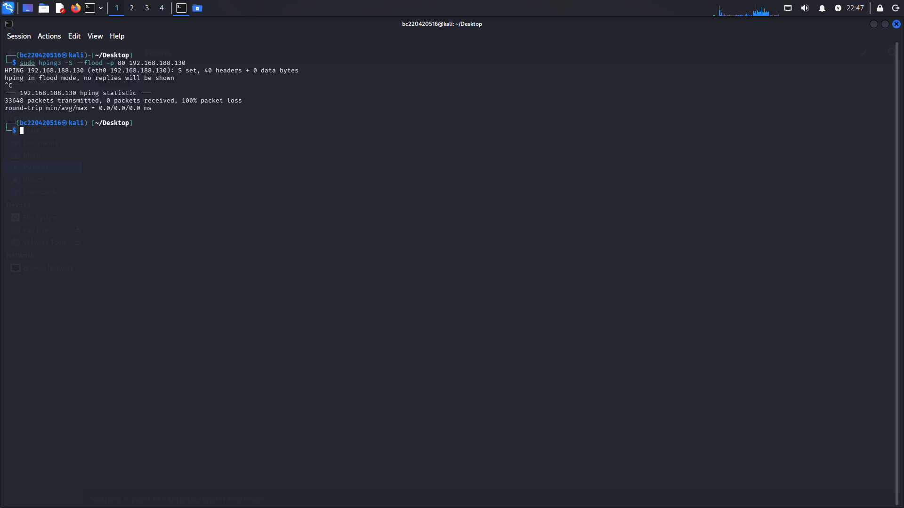
</div>

#### ③ Nmap Scan — Full Port Sweep (label `3`)

```bash
sudo nmap -sS -p- 192.168.188.130
```
> **Captured result:** stealth SYN scan across all 65,535 ports, discovering `21/tcp ftp`, `22/tcp ssh`, `80/tcp http` open and `65532` closed. Touching thousands of distinct destination ports drives `unique_dst_ports` and `port_entropy` sky-high — the scan signature.

<div align="center">
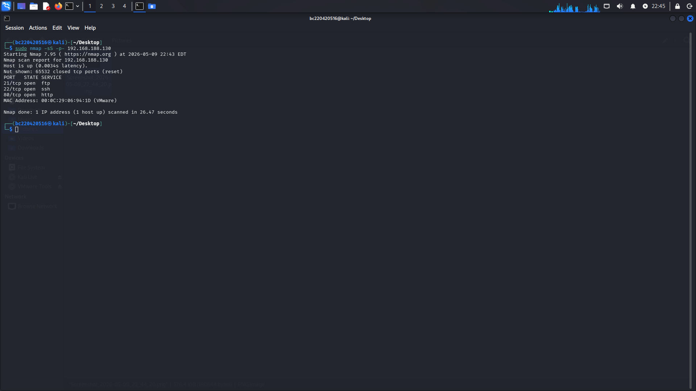
</div>

#### ④ Brute Force — SSH Password Attack (label `4`)

```bash
hydra -l bc220420516 -P passwords.txt ssh://192.168.188.130
```
> **Captured result:** `[DATA] max 16 tasks per 1 server, overall 16 tasks, 1001 login tries (l:1/p:1001), ~63 tries per task` — THC-Hydra hammers SSH with 1,001 password guesses. The rapid connect/reset cycling produces the elevated `rst_count` on port 22 that the custom `port22_rst_product` feature was built to detect.

<div align="center">
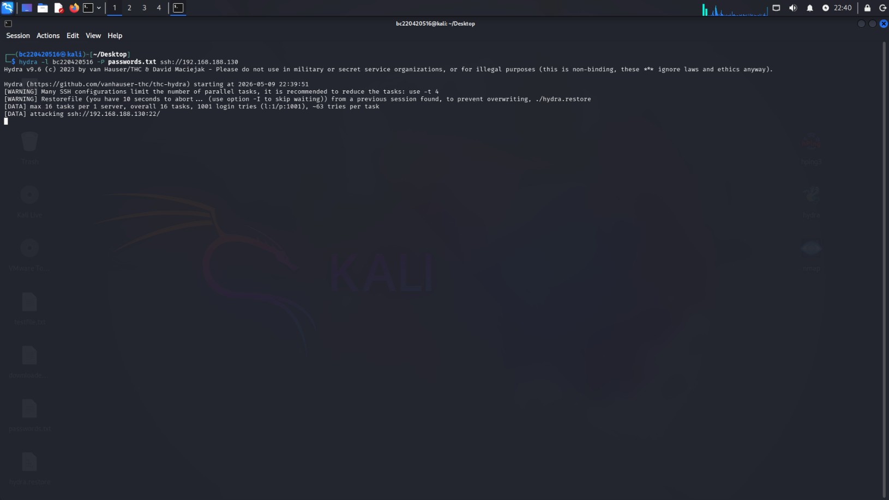
</div>

### All Captures Stored

All eight PCAPs, collected and ready for feature extraction:

<div align="center">
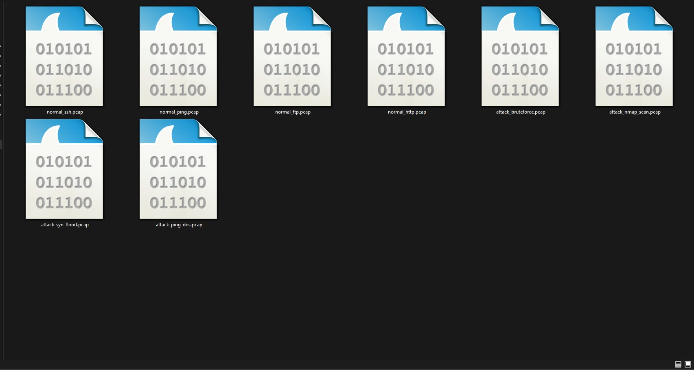
</div>

---

## 🔬 Phase 3 — Feature Engineering

`pcap_to_csv.py` is the heart of the training pipeline. It reads each PCAP, slices the packet stream into **1-second windows**, and computes **34 statistical and protocol-level features** for each window. Every window inherits the label of its source file, so the labelling is automatic and consistent.

<div align="center">
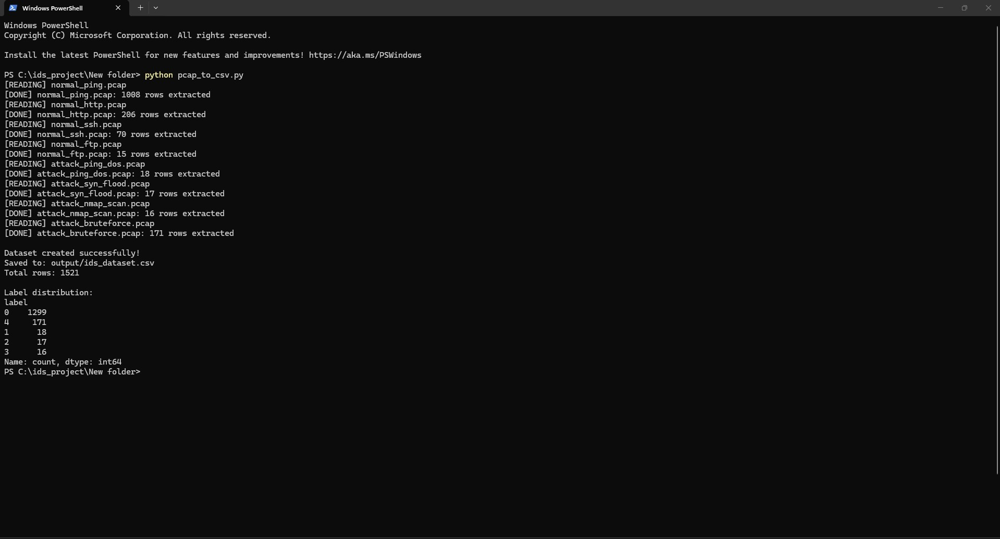
</div>

The pipeline produces a single clean, labelled dataset — **1,521 flow windows × 34 features + label**:

<div align="center">
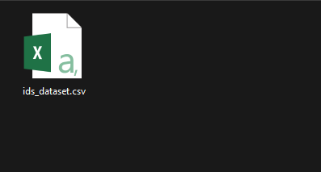
</div>

### Class Distribution

| Label | Class | Windows | Share |
|:-----:|:------|--------:|------:|
| `0` | Normal | 1,299 | 85.4% |
| `4` | Brute Force | 171 | 11.2% |
| `1` | Ping DoS | 18 | 1.2% |
| `2` | SYN Flood | 17 | 1.1% |
| `3` | Nmap Scan | 16 | 1.1% |
| | **Total** | **1,521** | **100%** |

> ⚖️ **On the imbalance:** flood attacks are, paradoxically, *underrepresented* by window count — they cram tens of thousands of packets into just a handful of 1-second windows, while benign traffic spreads thinly across many. This is handled two ways: `class_weight="balanced"` penalises the model more heavily for misclassifying rare classes, and the train/test split is **stratified** so every class appears in both partitions in proportion. The 99.74% figure is therefore not an artifact of the majority class dominating.

---

## 🤖 Phase 4 — Training & Benchmarking

`train_models.py` trains **five** classifiers on a stratified **75/25** split, prints a full classification report and confusion matrix for each, then persists every model plus the overall winner as `best_ids_model.pkl`.

<div align="center">
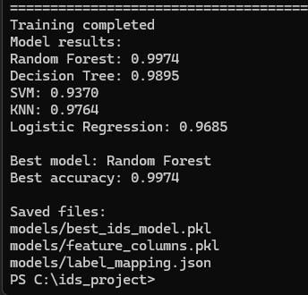
</div>

### Benchmark Results

These are the **actual measured accuracies** from the training run shown above:

| Rank | Model | Accuracy | Configuration |
|:----:|:------|---------:|:--------------|
| 🥇 | **Random Forest** | **99.74%** | 200 estimators, `class_weight="balanced"` |
| 🥈 | Decision Tree | 98.95% | `max_depth=8`, balanced |
| 🥉 | K-Nearest Neighbours | 97.64% | `k=5`, StandardScaler pipeline |
| 4 | Logistic Regression | 96.85% | `max_iter=3000`, scaled, balanced |
| 5 | Support Vector Machine | 93.70% | RBF kernel, scaled, balanced, `probability=True` |

All five accuracies exceed 93%, which is itself a strong signal that the engineered features are genuinely discriminative — even a linear model (Logistic Regression) separates the classes well. Random Forest wins because its ensemble of trees captures the non-linear feature interactions (e.g. `port_22 AND rst_burst AND many_source_ports`) that distinguish brute force from benign SSH.

### Exported Artifacts

```
models/best_ids_model.pkl      # the trained Random Forest classifier
models/feature_columns.pkl     # exact ordered list of the 34 feature names
models/label_mapping.json      # {0:"Normal", 1:"Ping DoS", 2:"SYN Flood", 3:"Nmap Scan", 4:"Brute Force"}
```

> 🔑 **Why `feature_columns.pkl` is critical:** scikit-learn models are sensitive to column *order*, not just column names. At inference time the live sniffer rebuilds a fresh feature DataFrame and reorders it with `row = row[feature_columns]` before calling `.predict()`. This guarantees the exact same column ordering used in training, eliminating an entire class of silent, hard-to-debug prediction errors.

---

## ⚡ Phase 5 — Real-Time Detection Engine

The deployed sensor (`Ubuntu Deployment Phase/app.py`) runs **two concurrent threads** sharing state behind a mutex:

1. A **Scapy sniffer loop** that captures, groups, extracts features, classifies, and logs.
2. A **Flask web server** that serves the dashboard and a `/status` JSON endpoint.

### Capture Filtering (BPF)

A precisely scoped Berkeley Packet Filter restricts capture to the three lab hosts and **explicitly excludes** the monitor's own address, the gateway, multicast, and broadcast — so the IDS never analyses its own dashboard traffic (which would create a runaway feedback loop) and never wastes cycles on irrelevant chatter.

<div align="center">
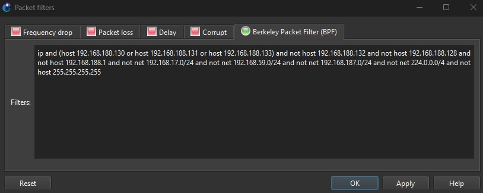
</div>

```python
INTERFACE = "ens33"
BPF_FILTER = (
    "ip and "
    "(host 192.168.188.130 or host 192.168.188.131 or host 192.168.188.133) "
    "and not host 192.168.188.132 "   # exclude the monitor itself
    "and not host 192.168.188.128 "
    "and not host 192.168.188.1 "     # exclude the gateway
    "and not net 224.0.0.0/4 "        # exclude multicast
    "and not host 255.255.255.255"    # exclude broadcast
)
```

### The Detection Pipeline

```
  ┌──────────────────────────────────────────────────────────────┐
  │  ①  sniff(iface="ens33", filter=BPF, timeout=1.0, store=True)  │
  └──────────────────────────┬───────────────────────────────────┘
                             ▼
  ┌──────────────────────────────────────────────────────────────┐
  │  ②  Group packets into flows: (src_ip, dst_ip, proto, dst_port)  │
  └──────────────────────────┬───────────────────────────────────┘
                             ▼
  ┌──────────────────────────────────────────────────────────────┐
  │  ③  Compute 34 features per flow  →  reorder to feature_columns  │
  └──────────────────────────┬───────────────────────────────────┘
                             ▼
  ┌──────────────────────────────────────────────────────────────┐
  │  ④  Random Forest .predict()  →  label 0-4  →  attack_type      │
  └──────────────────────────┬───────────────────────────────────┘
                             ▼
  ┌──────────────────────────────────────────────────────────────┐
  │  ⑤  Heuristic guards  →  suppress FPs / force-catch obvious floods │
  └──────────────────────────┬───────────────────────────────────┘
                             ▼
  ┌──────────────────────────────────────────────────────────────┐
  │  ⑥  5s alert hold  →  update dashboard state  →  write CSV log    │
  └──────────────────────────────────────────────────────────────┘
```

### Launching the Sensor

<div align="center">
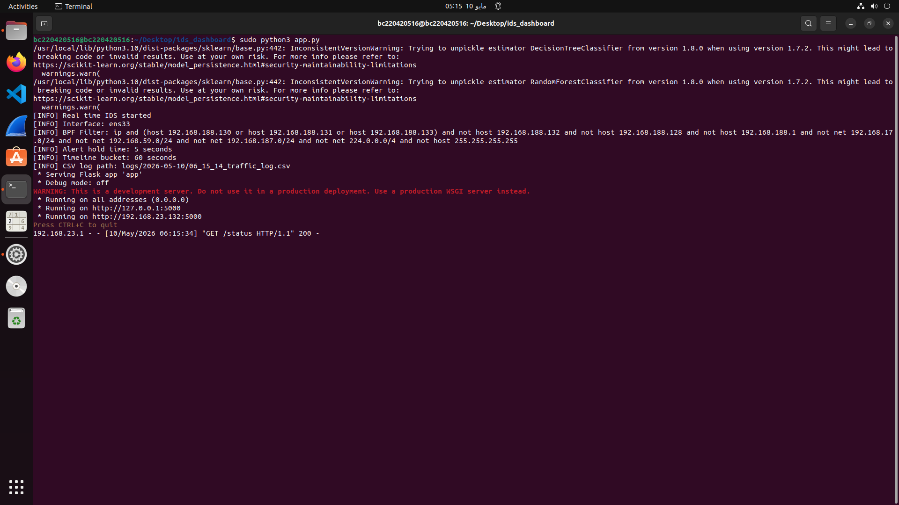
</div>

---

## 📊 The Live Dashboard

A single-page, dark-themed operations console served at `http://<monitor-ip>:5000`, built with Tailwind CSS and Chart.js, polling the `/status` endpoint every **500 ms**.

### 🟢 Safe State — no active threat

Green verdict card, "System Online" badge, live stat counters, and idle charts awaiting traffic.

<div align="center">
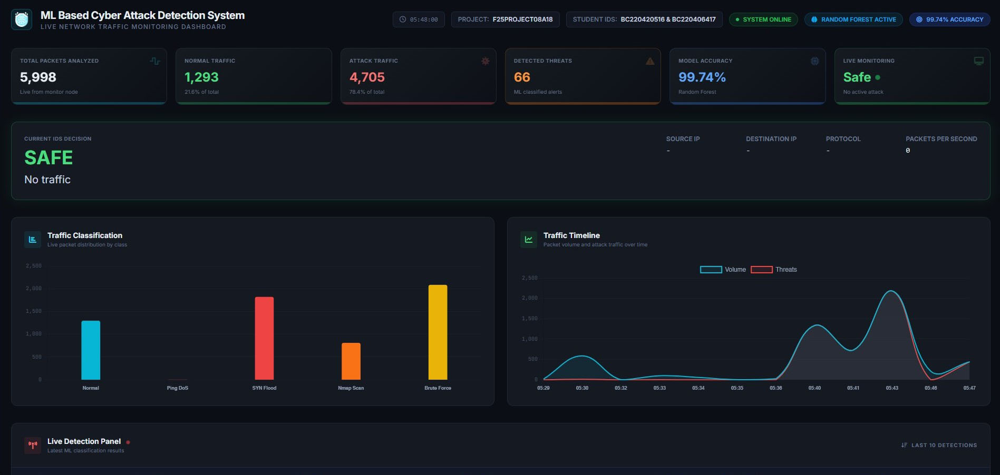
</div>

### 🔴 Alert State — live intrusion detected

The verdict card flips red with a glowing border, the system badge switches to *Attack Detected*, and a toast notification slides in from the corner naming the attack type, the target, and the source IP — all within about a second of the attack starting.

<div align="center">

</div>

### 📋 Live Detection Panel

A rolling table of the last 10 classifications — timestamp, source IP, destination IP, protocol, packet count, ML prediction, and a colour-coded threat badge (Critical / High / Medium / Low / Info).

<div align="center">
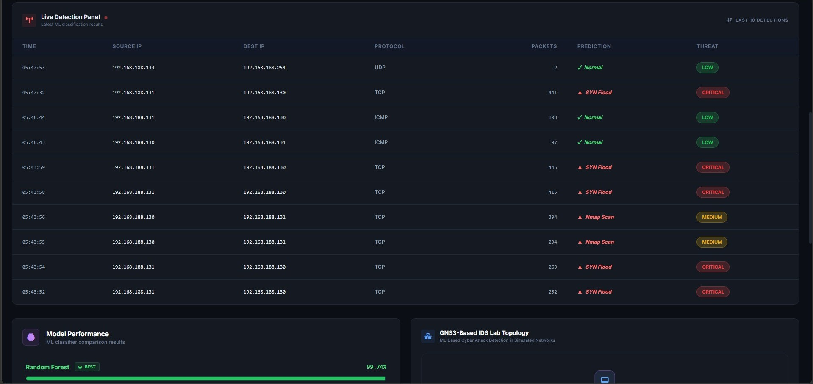
</div>

### 🧠 Model Performance & Topology View

Side-by-side accuracy bars for all five benchmarked classifiers, next to a live SVG rendering of the lab topology showing each node and its role.

<div align="center">
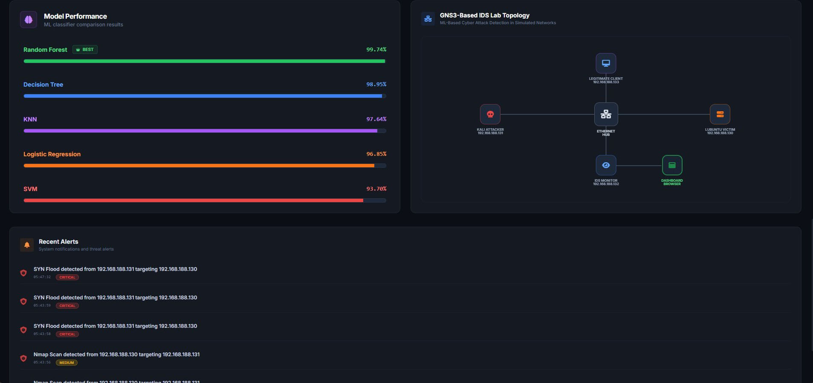
</div>

### 🔔 Recent Alerts Feed

A chronological feed of the last six alert/info events, each with a threat-level badge and timestamp.

<div align="center">
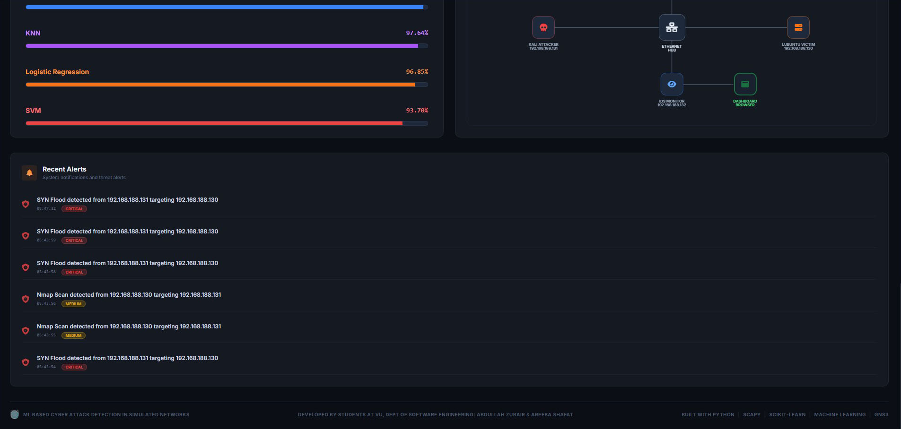
</div>

### Dashboard Components at a Glance

| Component | What it shows |
|:----------|:--------------|
| **Stat cards** | Total packets analysed, normal vs attack split (with %), detected threats, model accuracy, live status |
| **Current IDS Decision** | The verdict (SAFE/ALERT), attack type, source & destination IP, protocol, packets-per-second |
| **Traffic Classification** | Bar chart of live packet distribution across all 5 classes |
| **Traffic Timeline** | Dual line chart of total volume vs attack traffic, bucketed per 60 seconds |
| **Live Detection Panel** | Last 10 per-flow classifications with threat levels |
| **Model Performance** | Accuracy bars for all 5 benchmarked classifiers |
| **Topology Panel** | Live SVG diagram of the four lab nodes + hub |
| **Recent Alerts** | Last 6 alert/info events |
| **Toast notifications** | Transient pop-up fired on each newly detected intrusion |

---

## 📝 Forensic Logging

Every classified flow is appended to a CSV audit log. Logs are organised into **per-day folders** with a **per-session filename** (`HH_MM_SS_traffic_log.csv`), so concurrent or repeated runs never overwrite each other — a small but important detail for post-incident analysis.

<table>
<tr>
<td width="50%"><b>Monitor folder structure</b><br>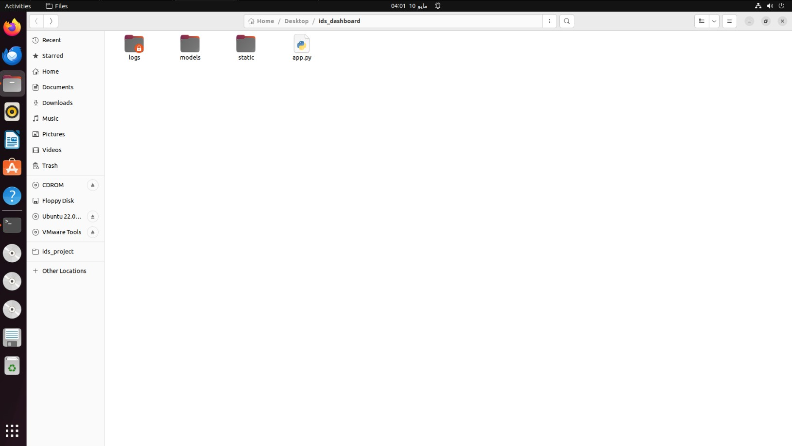</td>
<td width="50%"><b>Logs organised by date</b><br>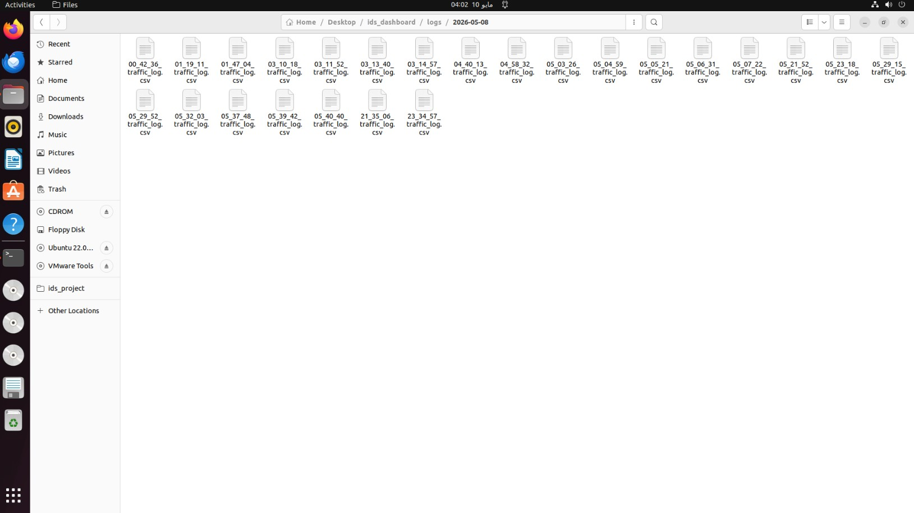</td>
</tr>
</table>

**Log schema:**

```csv
timestamp,status,prediction_label,attack_type,source_ip,destination_ip,protocol,packet_count,total_bytes,packets_per_second
```

Each row is a complete record of one classification decision — what was seen, when, from whom, to whom, and what the model concluded.

---

## 🚀 Installation & Usage

### Prerequisites

- **Python 3.10+**
- **Root/sudo privileges** on the monitor node (raw socket packet capture requires them)
- **GNS3 + VMware/VirtualBox** to rebuild the lab (optional — the pre-captured PCAPs are included, so you can retrain without rebuilding the network)

### Setup

```bash
git clone https://github.com/<your-username>/ML-based-Cyber-Attack-Detection-in-Simulated-Networks.git
cd ML-based-Cyber-Attack-Detection-in-Simulated-Networks

python3 -m venv .venv
source .venv/bin/activate          # Windows: .venv\Scripts\activate

pip install -r requirements.txt
```

<details>
<summary><b>📦 requirements.txt</b></summary>

```txt
scapy>=2.5.0
scikit-learn>=1.3.0
pandas>=2.0.0
joblib>=1.3.0
flask>=3.0.0
```

</details>

### 1️⃣ Rebuild the dataset from PCAPs *(optional)*

```bash
cd "Windows Training Phase"
python pcap_to_csv.py
# → output/ids_dataset.csv   (1,521 windows × 34 features)
```

### 2️⃣ Retrain and benchmark the models *(optional)*

```bash
python train_models.py
# → models/best_ids_model.pkl, feature_columns.pkl, label_mapping.json
# prints per-model accuracy, classification report, and confusion matrix
```

### 3️⃣ Run the live IDS

First, adjust the two environment-specific constants at the top of `Ubuntu Deployment Phase/app.py` to match your setup:

```python
INTERFACE  = "ens33"                    # ← your monitoring NIC (find it with `ip a`)
BPF_FILTER = "ip and (host ...)"        # ← your lab's host addresses
```

Then launch (root required for capture):

```bash
cd "Ubuntu Deployment Phase"
sudo python3 app.py
```

Open **`http://<monitor-ip>:5000`** in a browser and watch it live. 🎉

### 4️⃣ Reproduce the attacks *(from the Kali attacker)*

```bash
sudo ping -f 192.168.188.130                              # Ping DoS
sudo hping3 -S --flood -p 80 192.168.188.130             # SYN Flood
sudo nmap -sS -p- 192.168.188.130                        # Nmap Scan
hydra -l <user> -P passwords.txt ssh://192.168.188.130   # SSH Brute Force
```

---

## 🧬 Complete Feature Reference

All **34 features** computed per 1-second flow window, grouped by category.

<details open>
<summary><b>📊 Volume & Size (6)</b></summary>

| Feature | Description |
|:--------|:------------|
| `packet_count` | Number of packets in the window |
| `total_bytes` | Total bytes across all packets |
| `avg_packet_length` | Mean packet size |
| `min_packet_length` | Smallest packet |
| `max_packet_length` | Largest packet |
| `avg_bytes_per_pkt` | Smoothed bytes-per-packet ratio |

</details>

<details>
<summary><b>⏱️ Rate & Timing (4)</b></summary>

| Feature | Description |
|:--------|:------------|
| `duration` | Time span of the window in seconds |
| `packets_per_second` | Packet rate — the primary DoS signal |
| `bytes_per_second` | Throughput |
| `rst_per_second` | RST rate — a brute-force / refused-connection signal |

</details>

<details>
<summary><b>🔌 Protocol Mix (3)</b></summary>

| Feature | Description |
|:--------|:------------|
| `tcp_count` | TCP packets in the window |
| `udp_count` | UDP packets in the window |
| `icmp_count` | ICMP packets — the Ping DoS signal |

</details>

<details>
<summary><b>🚩 TCP Flags (7)</b></summary>

| Feature | Description |
|:--------|:------------|
| `syn_count` | SYN flags — the SYN flood signal |
| `ack_count` | ACK flags |
| `rst_count` | RST flags — refused / reset connections |
| `fin_count` | FIN flags |
| `psh_count` | PSH flags |
| `urg_count` | URG flags |
| `rst_syn_ratio` | RST ÷ SYN — separates half-open floods from refused connections |

</details>

<details>
<summary><b>🎯 Ports & Endpoints (11)</b></summary>

| Feature | Description |
|:--------|:------------|
| `unique_src_ports` | Distinct source ports |
| `unique_dst_ports` | Distinct destination ports — the port-scan signal |
| `unique_src_ips` | Distinct source IPs |
| `unique_dst_ips` | Distinct destination IPs |
| `port_20_count` | FTP data-channel hits |
| `port_21_count` | FTP control-channel hits |
| `port_22_count` | SSH hits |
| `port_80_count` | HTTP hits |
| `port_443_count` | HTTPS hits |
| `top_dst_port` | The single most-targeted destination port |
| `unique_src_ports_log` | `log1p` of the source-port spread (compresses large ranges) |

</details>

<details>
<summary><b>🧪 Custom Composite Features (3) — the secret sauce</b></summary>

These three were engineered specifically to solve the **hardest classification problem in the dataset: separating legitimate SSH from SSH brute force.** Both are TCP traffic on port 22, so simple features can't tell them apart. These composites can:

| Feature | Formula | Rationale |
|:--------|:--------|:----------|
| `port_entropy` | `unique_dst_ports ÷ (packet_count + 1)` | High when few packets touch many ports → hallmark of a port scan |
| `port22_rst_product` | `port_22_count × rst_count` | Non-zero only when SSH traffic *and* connection resets co-occur → the exact fingerprint of failed authentication attempts |
| `port22_src_diversity` | `port_22_count × unique_src_ports` | Brute-force tools cycle through many ephemeral source ports; a genuine human SSH session uses very few |

</details>

---

## 📈 Results Summary

<div align="center">

| Metric | Result |
|:-------|:-------|
| **Best model** | Random Forest (200 trees, class-balanced) |
| **Test accuracy** | **99.74%** |
| **Runner-up** | Decision Tree — 98.95% |
| **Dataset size** | 1,521 labelled flow windows |
| **Features** | 34 engineered (incl. 3 custom composites) |
| **Classes** | 5 (1 benign + 4 attack) |
| **Train / test split** | 75 / 25, stratified |
| **Source captures** | 8 hand-made PCAPs (~96 MB) |
| **Detection window** | 1.0 second |
| **Dashboard refresh** | 500 ms |
| **Alert hold time** | 5 seconds |
| **Models benchmarked** | 5 |

</div>

---

## 🏗️ Design Decisions & Engineering Notes

Three pieces of the deployment logic deserve special attention — they're what separate this from a naive `model.predict()` demo:

### 1. True attacker attribution (`determine_flow_direction`)

Rather than blindly trusting the first packet's source, the system determines the *real* initiator of a flow through a prioritised cascade:

1. Look for a lone `SYN` with no `ACK` — the classic connection initiator.
2. Failing that, look for an ICMP echo *request* (`type 8`).
3. Failing that, look for traffic toward a well-known service port (20/21/22/80/443).
4. Only as a last resort, fall back to the most frequent IP pair.

The result: the dashboard correctly reports the **Kali attacker** as the source, not the victim replying to it.

### 2. Heuristic guards reinforcing the ML model

Pure ML on 1-second windows can wobble on tiny samples, so two deterministic rules back it up:

- An `Nmap Scan` prediction on a window of **fewer than 5 packets** is downgraded to `Normal` — suppressing false positives on sparse, ambiguous traffic.
- Any window with **≥15 ICMP packets and zero TCP/UDP** is force-classified as `Ping DoS` — catching an obvious flood even if the model hesitates.

### 3. Alert hold + recent-attack memory

Real attacks are bursty, not continuous. A 5-second `ALERT_HOLD_TIME` keeps the dashboard in its alert state between bursts, and a `recent_attacks` map remembers attacker↔victim pairs so a brief mid-attack lull isn't misread as "safe". This makes the live display stable and trustworthy instead of flickering.

---

## ⚠️ Limitations & Future Work

An honest accounting of where the system stands and where it could go:

- **Closed-world assumption** — the model classifies into 5 known classes only. A novel attack will be forced into the nearest class rather than flagged as unknown. *Next step: add an anomaly/one-class detector as a second stage.*
- **Small, imbalanced dataset** — three attack classes have fewer than 20 windows each. The 99.74% reflects a controlled lab, **not** production traffic. *Next step: longer and more varied captures, plus synthetic augmentation for rare classes.*
- **Lab-specific configuration** — `INTERFACE` and `BPF_FILTER` are hardcoded to this topology. *Next step: move them to a config file or CLI flags.*
- **Encrypted-payload blindness** — detection is purely flow-statistical; there is no deep packet inspection (which is also what makes it privacy-preserving).
- **Detection, not prevention** — the system alerts but does not block. *Next step: an optional `iptables`/`nftables` auto-mitigation hook.*
- **Single sensor point** — one hub-attached monitor. *Next step: distributed sensors feeding a central aggregator.*

---

## 🔒 Security & Ethics Notice

> **This project is for educational and research use in an isolated laboratory environment only.**
>
> - Every attack was executed against **virtual machines owned by the authors** on an **air-gapped virtual network**. Never run these tools against systems you do not own or lack explicit written authorisation to test. Unauthorised scanning, flooding, or brute forcing is illegal in most jurisdictions.
> - The `tools/` directory contains a **wordlist and a traffic-generation script with lab-only placeholder credentials**, included solely to reproduce the training captures. **Rotate and remove them before reusing any part of this repository**, and never commit real credentials to version control.
> - The Flask server binds to `0.0.0.0:5000` with **no authentication** — appropriate for a closed lab, unsafe on any real network. Add authentication and TLS before any wider deployment.

---

## 👥 Authors

Built as a final-year project at the **Department of Software Engineering, Virtual University of Pakistan** — project code **F25PROJECT08A18**.

| Author | Student ID |
|:-------|:-----------|
| **Abdullah Zubair** | BC220420516 |
| **Areeba Shafat** | BC220406417 |

---

## 📄 License

Released under the **MIT License** — see [`LICENSE`](LICENSE) for full text.

---

<div align="center">

### ⭐ If this project helped you understand how ML-based intrusion detection actually works end-to-end, consider starring the repo.

**Built with** Python · Scapy · scikit-learn · Flask · Chart.js · Tailwind CSS · GNS3 · Kali Linux

<sub>ML Based Cyber Attack Detection in Simulated Networks — F25PROJECT08A18</sub>

</div>
